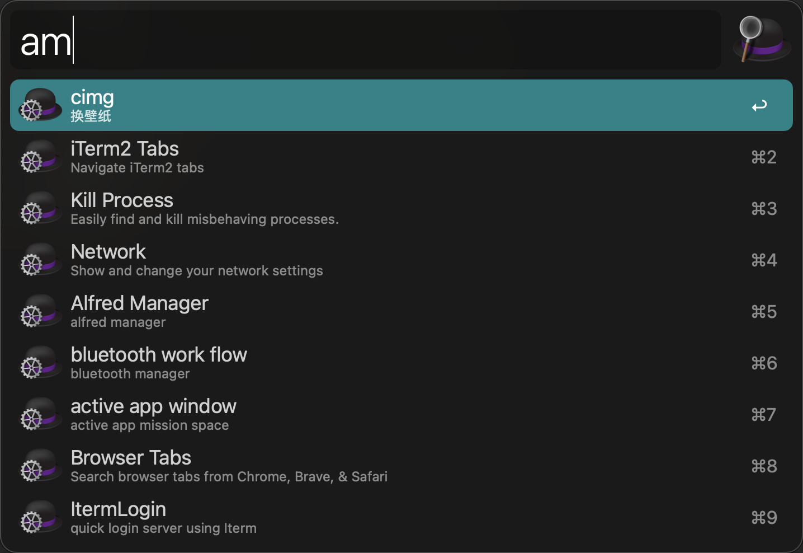
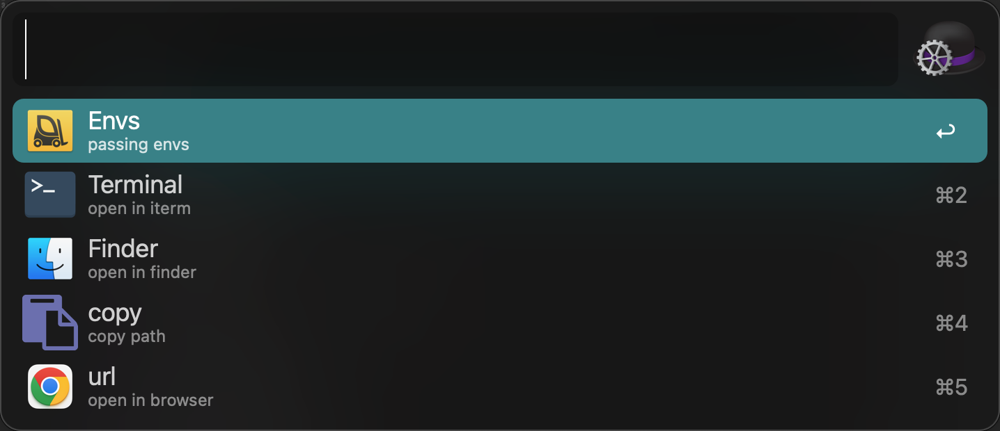

# alfred-manager-flow

## Usage

1. using `am` trigger search && list workflows
   
   

2. after `enter` , I provide 5 functions
   
   
   
   1. open workflows in terminal
   
   2. copy workflows path
   
   3. open workflows in finder
   
   4. copy workflows envs
   
   5. open workflows wensite in default browser

## Install

Download from [Releases · o98k-ok/alfred-manager-flow · GitHub](https://github.com/o98k-ok/alfred-manager-flow/releases) 

## More

You may want more [GitHub - o98k-ok/awesome-alfred-workflow: awesome alfred workflow for programmer](https://github.com/o98k-ok/awesome-alfred-workflow)